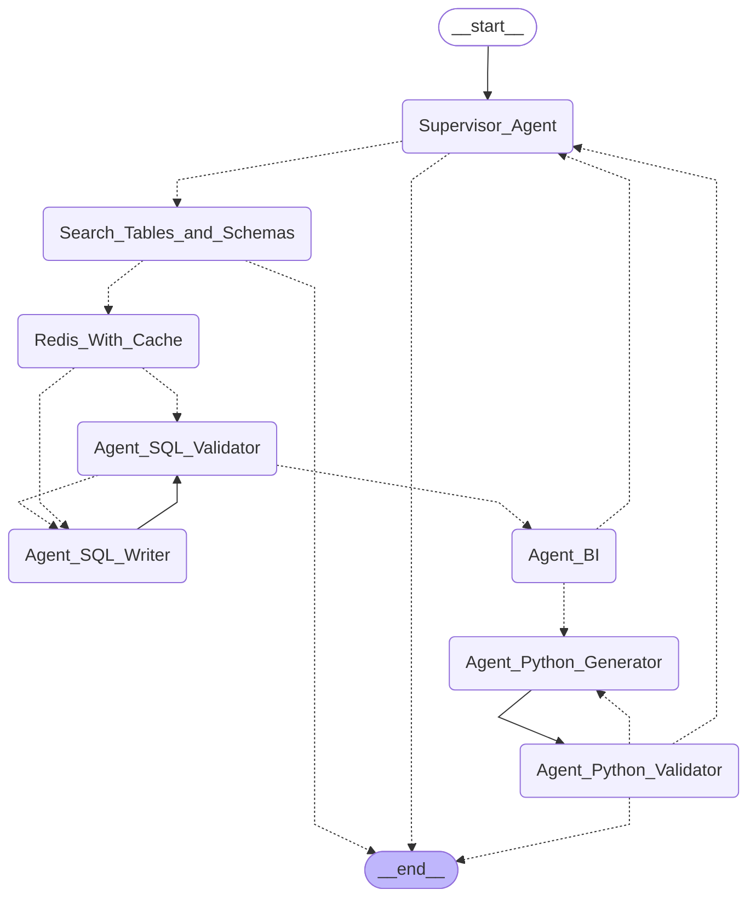

# LangGraph Diagram

```mermaid
---
config:
  flowchart:
    curve: linear
---
graph TD;
	__start__([<p>__start__</p>]):::first
	Supervisor_Agent(Supervisor_Agent)
	Search_Tables_and_Schemas(Search_Tables_and_Schemas)
	Redis_With_Cache(Redis_With_Cache)
	Agent_SQL_Writer(Agent_SQL_Writer)
	Agent_SQL_Validator(Agent_SQL_Validator)
	Agent_BI(Agent_BI)
	Agent_Python_Generator(Agent_Python_Generator)
	Agent_Python_Validator(Agent_Python_Validator)
	__end__([<p>__end__</p>]):::last
	Agent_BI -.-> Agent_Python_Generator;
	Agent_BI -.-> Supervisor_Agent;
	Agent_Python_Generator --> Agent_Python_Validator;
	Agent_Python_Validator -.-> Agent_Python_Generator;
	Agent_Python_Validator -.-> Supervisor_Agent;
	Agent_SQL_Validator -.-> Agent_BI;
	Agent_SQL_Validator -.-> Agent_SQL_Writer;
	Agent_SQL_Writer --> Agent_SQL_Validator;
	Redis_With_Cache -.-> Agent_SQL_Validator;
	Redis_With_Cache -.-> Agent_SQL_Writer;
	Search_Tables_and_Schemas -.-> Redis_With_Cache;
	Search_Tables_and_Schemas -.-> __end__;
	Supervisor_Agent -.-> Search_Tables_and_Schemas;
	Supervisor_Agent -.-> __end__;
	__start__ --> Supervisor_Agent;
	Agent_Python_Validator -.-> __end__;
	classDef default fill:#f2f0ff,line-height:1.2
	classDef first fill-opacity:0
	classDef last fill:#bfb6fc

```
